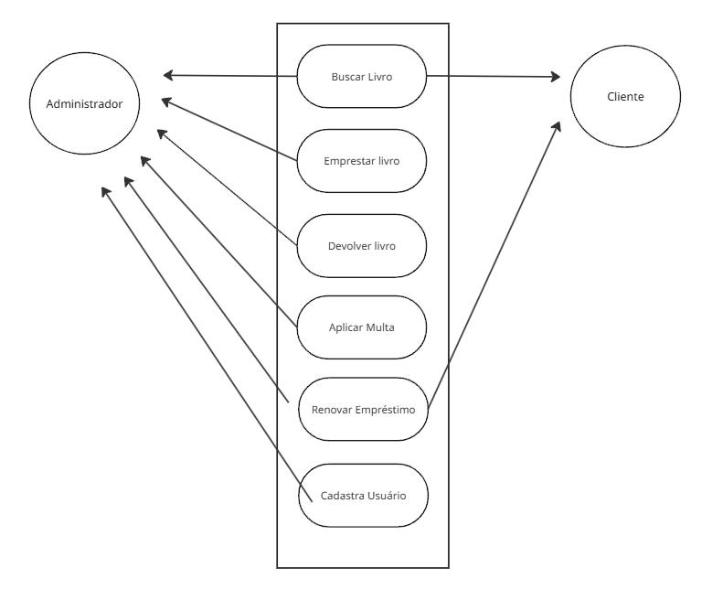
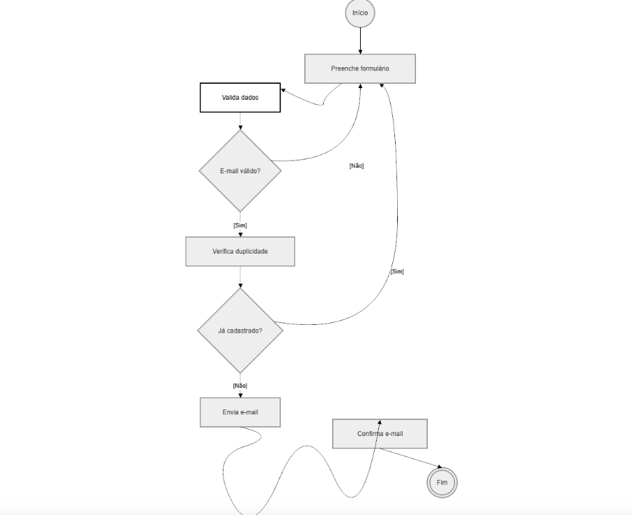
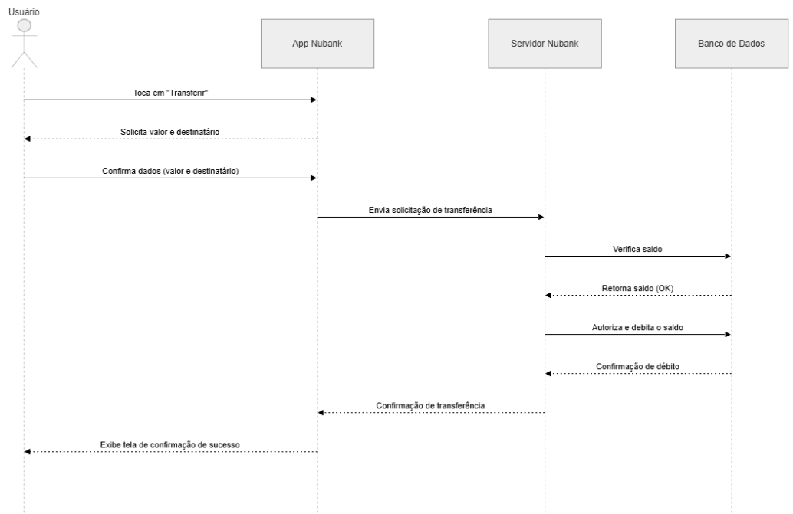
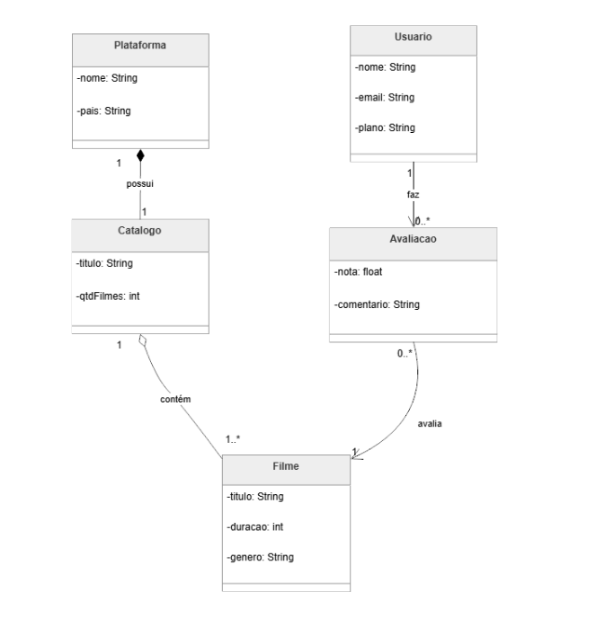

# 📚 Portfólio — Engenharia de Software | FIAP 2026

## 📖 Sobre este repositório

Este repositório foi desenvolvido para armazenar as atividades e exercícios realizados durante a disciplina de Engenharia de Software da FIAP 2026.

O portfólio reúne conteúdos práticos relacionados à modelagem de sistemas, documentação de requisitos, diagramas UML e arquitetura de software. Cada aula contém os arquivos produzidos no Google Colab, diagramas desenvolvidos durante as atividades e exemplos de execução dos exercícios.

---

# 🚀 Como executar os exercícios

## ✅ Pré-requisitos

Antes de executar os exercícios, é necessário possuir:

- Python 3.x instalado
- Conta Google para acesso ao Google Colab
- Navegador atualizado
- GitHub Desktop ou Git (opcional)

---

## ⚙️ Instalação

Clone este repositório:

```bash
git clone https://github.com/Lopes626626/Engenharia-de-Software.git
```

Acesse a pasta do projeto:

```bash
cd seu-repositorio
```

Abra os arquivos `.ipynb` no Google Colab ou em outra plataforma compatível com Jupyter Notebook.

---

# 📂 Exercícios por Aula

---

## Aula 03 — Requisitos Funcionais vs. Não-Funcionais

### 💻 Código

Arquivo: [`gymtrack_validador.ipynb`](aula-03-requisitos/gymtrack_validador.ipynb)

Nesta atividade foram estudadas as diferenças entre requisitos funcionais e não-funcionais dentro do desenvolvimento de software. O exercício apresentou exemplos práticos utilizados para compreender como os requisitos influenciam o comportamento e a qualidade de um sistema.

### 🖥️ Execução

A execução foi realizada no Google Colab, apresentando exemplos e classificações de requisitos aplicados em sistemas computacionais.

---

## Aula 04 — Documento SRS

### 💻 Código

Arquivo: [`srs_marketplace.ipynb`](aula-04-srs/srs_marketplace.ipynb)

O exercício abordou a elaboração de um documento SRS (Software Requirements Specification), responsável por documentar os requisitos do sistema de forma estruturada e organizada.

### 🖥️ Execução

A atividade demonstrou a organização das informações e a importância da documentação de requisitos para o processo de desenvolvimento de software.

---

## Aula 05 — UML e Casos de Uso

### 📐 Diagrama



O diagrama de casos de uso representa as interações entre os atores e as funcionalidades principais do sistema. A modelagem foi utilizada para facilitar a compreensão dos processos executados pelo usuário.

### 💻 Código

Arquivo: [`biblioteca_digital.ipynb`](aula-05-casos-de-uso/biblioteca_digital.ipynb)

O notebook apresenta atividades relacionadas à modelagem UML e à representação de funcionalidades do sistema por meio de casos de uso.

### 🖥️ Execução

A execução no Google Colab demonstrou o funcionamento dos exemplos desenvolvidos durante a aula e a aplicação prática dos conceitos de modelagem.

---

## Aula 06 — Diagramas de Atividades

### 📐 Diagrama



O diagrama de atividades foi utilizado para representar o fluxo de execução das ações do sistema, demonstrando decisões, processos e caminhos possíveis durante a execução.

### 💻 Código

Arquivo: [`cadastro_usuario.ipynb`](aula-06-atividades/cadastro_usuario.ipynb)

O notebook desenvolvido apresenta exercícios relacionados à lógica de execução e representação de processos utilizando diagramas de atividades.

### 🖥️ Execução

A execução apresentou o fluxo lógico dos processos modelados e auxiliou na compreensão da sequência das atividades do sistema.

---

## Aula 07 — Diagramas de Sequência

### 📐 Diagrama



O diagrama de sequência representa a troca de mensagens entre os objetos do sistema ao longo do tempo, demonstrando a comunicação entre diferentes componentes.

### 💻 Código

Arquivo: [`transferencia_nubank.ipynb`](aula-07-sequencia/transferencia_nubank.ipynb)

O notebook contém exemplos relacionados à comunicação entre objetos e à execução sequencial das operações do sistema.

### 🖥️ Execução

A atividade demonstrou a ordem das interações entre os componentes e a sequência lógica dos processos modelados.

---

## Aula 08 — Diagramas de Classes

### 📐 Diagrama



O diagrama de classes apresenta a estrutura do sistema orientado a objetos, incluindo atributos, métodos e relacionamentos entre classes em esquema de Netflix.

### 💻 Código

Arquivo: [`streaming_netflix.ipynb`](aula-08-classes/streaming_netflix.ipynb)

O notebook apresenta exemplos práticos relacionados à modelagem orientada a objetos e à organização estrutural das classes do sistema usando de exemplo streaming de netflix.

### 🖥️ Execução

A execução demonstrou o funcionamento das classes implementadas e a aplicação dos conceitos de orientação a objetos.

---

# 🔗 Links

- 💻 GitHub: https://github.com/Lopes626626/Engenharia-de-Software
- 🎓 FIAP: https://www.fiap.com.br
- 📓 Google Colab: https://colab.research.google.com/

---

# 👨‍💻 Autor

Desenvolvido por Rafael Lopes para a disciplina de Engenharia de Software — FIAP 2026.
